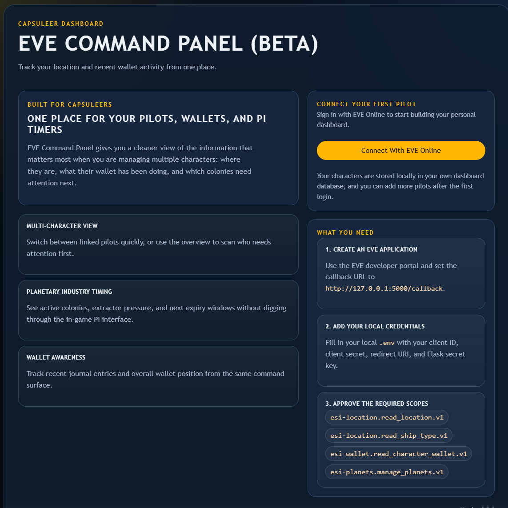

# EVE ESI Dashboard Flask App

This Flask app:

1. Redirects you to EVE Online SSO
2. Exchanges the authorization code for tokens
3. Extracts your character ID from the returned access token
4. Calls ESI to fetch your current character location
5. Shows wallet balance, a 24 hour wallet activity summary, and the last 5 wallet journal entries
6. Shows your PI colonies and which ones need attention soon
7. Saves multiple characters locally so you can switch between them with tabs
8. Caches each character dashboard locally and refreshes it in the background

## Preview



## New User Install Guide

If you have not used Python before, follow these steps on Windows:

1. Install Python
   Download Python 3 from `https://www.python.org/downloads/`.
   During install, make sure you tick `Add Python to PATH`.

2. Download this project
   Put the project folder somewhere easy to find, such as your Desktop.

3. Open PowerShell in the project folder
   In File Explorer, open the project folder, click the address bar, type `powershell`, and press Enter.

4. Check Python is installed

```powershell
python --version
```

You should see a Python version printed, for example `Python 3.14.3`.

5. Create a virtual environment

```powershell
python -m venv .venv
```

6. Activate the virtual environment

```powershell
.\.venv\Scripts\Activate.ps1
```

If PowerShell blocks the script, run this once in the same window:

```powershell
Set-ExecutionPolicy -Scope Process -ExecutionPolicy Bypass
```

Then run the activate command again.

7. Install the required packages

```powershell
pip install -r requirements.txt
```

8. Create your local environment file

```powershell
Copy-Item .env.example .env
```

9. Create an EVE application
   Go to the EVE developer portal and create a new application.
   Set the callback URL to:

`http://127.0.0.1:5000/callback`

Use these scopes:

- `esi-location.read_location.v1`
- `esi-location.read_ship_type.v1`
- `esi-wallet.read_character_wallet.v1`
- `esi-planets.manage_planets.v1`

If you prefer, you can grant all available ESI scopes in your EVE application instead.
That is not required for this app today, but it can make future development easier because you will be less likely to need to update scopes and re-authorize characters later.

10. Fill in `.env`
    Open `.env` in a text editor and add your real values for:

- `EVE_CLIENT_ID`
- `EVE_CLIENT_SECRET`
- `EVE_REDIRECT_URI`
- `FLASK_SECRET_KEY`

Example redirect URI:

`EVE_REDIRECT_URI=http://127.0.0.1:5000/callback`

11. Start the app

```powershell
python app.py
```

12. Open the dashboard
    Visit:

`http://127.0.0.1:5000`

## Quick Setup

Create an application in the EVE developer portal and set the callback URL to:

`http://127.0.0.1:5000/callback`

The app needs these scopes:

- `esi-location.read_location.v1`
- `esi-location.read_ship_type.v1`
- `esi-wallet.read_character_wallet.v1`
- `esi-planets.manage_planets.v1`

You can also choose to enable all ESI scopes in your EVE application if you want to avoid scope changes later during future development.

Then create a virtual environment and install dependencies:

```powershell
python -m venv .venv
.\.venv\Scripts\Activate.ps1
pip install -r requirements.txt
```

Copy `.env.example` to `.env` and fill in your EVE SSO credentials:

```powershell
Copy-Item .env.example .env
```

If you want to keep a deeper wallet history locally, set `WALLET_JOURNAL_CACHE_LIMIT` in `.env`.
The default is `1000`, and the app now paginates through the ESI wallet journal instead of storing only the first page.

## Run

```powershell
.\.venv\Scripts\Activate.ps1
python app.py
```

Open `http://127.0.0.1:5000`.

## Docker

You can also run the app with Docker.

The important part is that the SQLite database should live on your machine, not only inside the container. This project supports that by using the `DATABASE_PATH` environment variable and a bind-mounted `data` folder.
The app log file can live there too, using `LOG_PATH`.

1. Create a local data folder

```powershell
New-Item -ItemType Directory -Force data
```

2. Make sure your `.env` file exists and contains your EVE credentials

```powershell
Copy-Item .env.example .env
```

3. Build the Docker image

```powershell
docker build -t eve-esi-dashboard .
```

4. Run the container

```powershell
docker run --rm -p 5000:5000 --env-file .env -e DATABASE_PATH=/data/eve_dashboard.db -v "${PWD}/data:/data" eve-esi-dashboard
```

Open `http://127.0.0.1:5000`.

### Docker Notes

- The database file will be stored on your machine in `./data/eve_dashboard.db`.
- The app log file will be stored on your machine in `./data/eve_dashboard.log`, with daily rollover files alongside it.
- Because the database is bind-mounted from the host, your characters and cache survive container restarts and container deletion.
- Because the log file is also bind-mounted from the host, refresh errors and app events are still available after container restarts.
- If you remove the `data` folder, you remove the saved database too.
- If you are using Docker Desktop on Windows and `${PWD}` does not work in your shell, replace it with the full folder path.

### Linux Redeploy Script

If you are deploying on Linux, you can use the included redeploy script to stop the current container, rebuild the image, and start it again without losing the mounted database or log files.

1. Make the script executable

```bash
chmod +x scripts/redeploy-linux.sh
```

2. Run the redeploy

```bash
./scripts/redeploy-linux.sh
```

By default it uses:

- image name: `eve-esi-dashboard`
- container name: `eve-esi-dashboard`
- port: `5000`
- env file: `./.env`
- data directory: `./data`

You can override them when needed, for example:

```bash
APP_PORT=8080 CONTAINER_NAME=eve-dashboard-prod ./scripts/redeploy-linux.sh
```

## Notes

- This app uses the server-side authorization code flow with your client secret.
- Authorized characters are stored locally in `eve_dashboard.db` by default, or in the path set by `DATABASE_PATH`.
- Wallet journal entries are stored locally and retained over time by character, with duplicate protection based on the ESI journal entry ID.
- The app writes a daily rotating log file next to the database by default, or in the path set by `LOG_PATH`.
- Daily log retention defaults to 14 files and can be changed with `LOG_BACKUP_DAYS` in `.env`.
- Dashboard data is cached locally for 15 minutes to keep tab switching fast.
- A background thread checks every 10 seconds and refreshes characters whose cache is stale.
- PI attention defaults to `PI_ATTENTION_WINDOW_HOURS` from `.env`, and each dashboard can override it in the UI with its own saved 1-24 hour setting.
- The `/location` route returns the dashboard JSON summary.
- If your token expires, the app refreshes it automatically using the stored refresh token.
- If you add new scopes later, log out and log in again so EVE grants the updated permissions.
